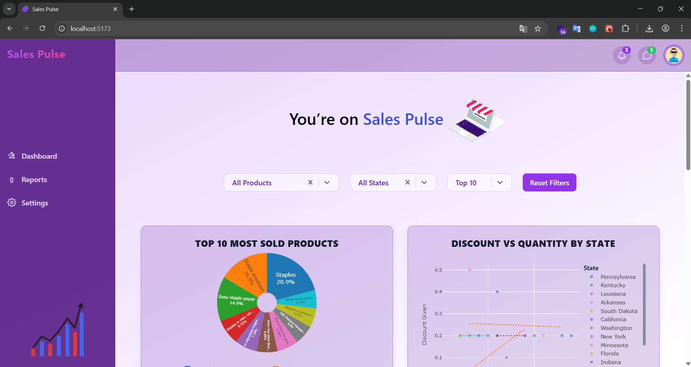
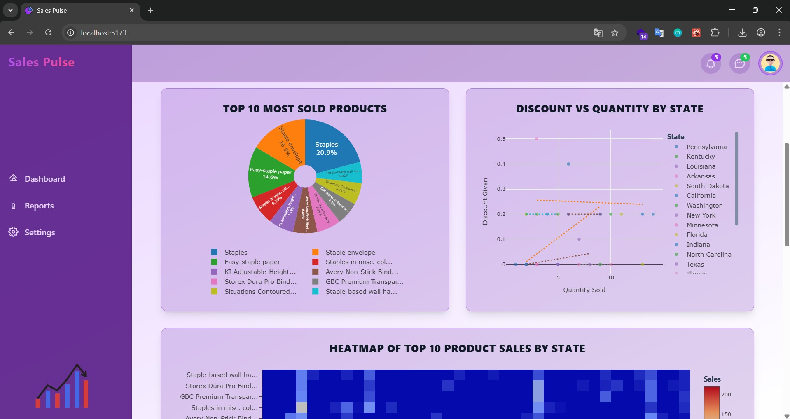
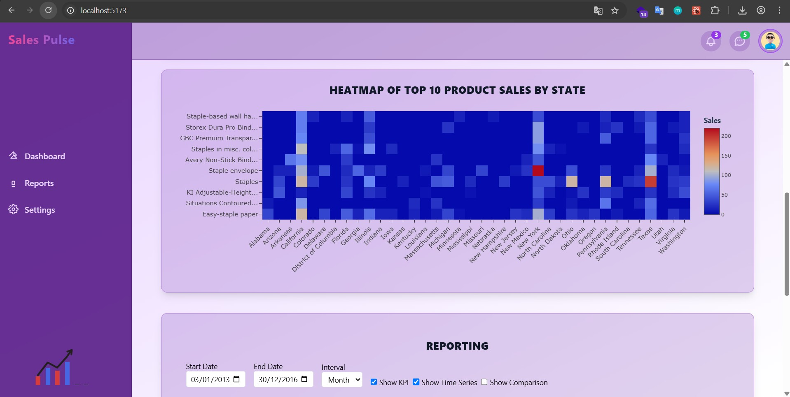
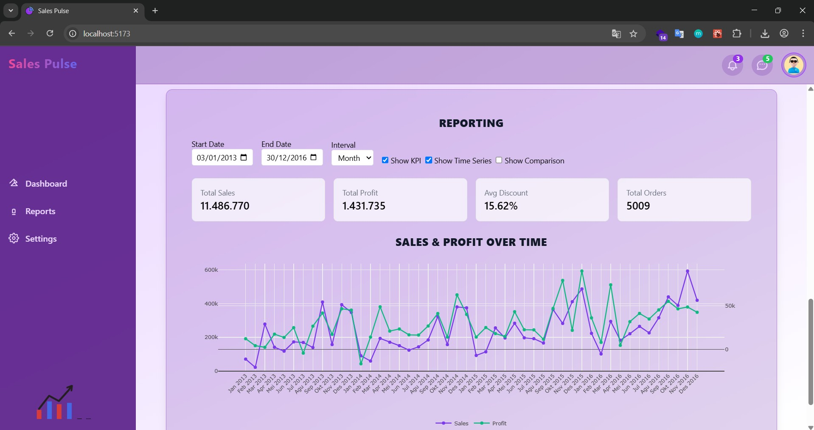
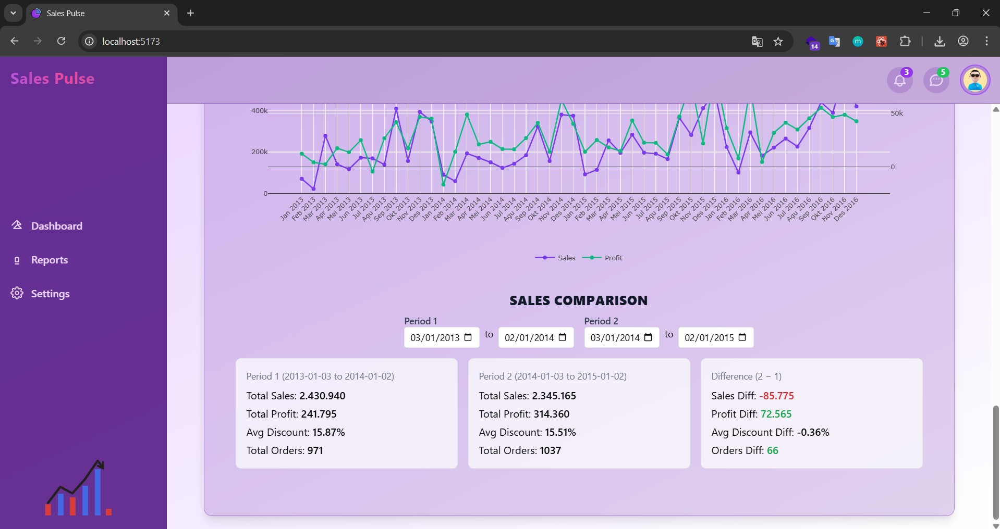

# Sales Pulse

**Sales Pulse** is a full-stack analytics solution for retail sales data, combining a robust backend service for ETL and APIs, and a feature-rich frontend dashboard for visualization and reporting. This monorepo contains two subprojects:

* **Backend**: Node.js + Express + PostgreSQL service with streaming ETL, data validation, structured logging, and RESTful endpoints for analytics and lightweight reporting.
* **Frontend**: React + Vite application offering interactive dashboards (charts, filters, reporting) built with Plotly, Tailwind CSS, React Query, Zustand, and Lottie animations.

Below is an in-depth overview of each, including features, technologies, and setup.

## 🚀 Getting Started

### Prerequisites

* **Node.js**: v20+ recommended for both backend and frontend
* **npm** or **yarn**
* **PostgreSQL**: v17+ (or compatible) for backend database
* **Git**

### 1. Clone the Repository

```bash
git clone https://github.com/your-org/sales-pulse.git
cd sales-pulse
```

### 2. Review Sub-project Documentation

* **Backend** instructions: `backend/README.md`
* **Frontend** instructions: `frontend/README.md`

### 3. Setup Backend

```bash
cd backend
cp .env.example .env
npm install
# Configure .env with your DB credentials, ETL file path, CORS origin, etc.
npm run migrate    # Apply database migrations
npm run dev        # Start development server (nodemon)
# or npm start     # Start production server
```

* **ETL**: To ingest data from Excel, run:

  ```bash
  npm run etl
  ```

  Ensure `ETL_FILE_PATH` in `.env` points to your dataset file. Monitor logs for progress.

* **API Base URL**: By default, `http://localhost:3001/api`.

### 4. Setup Frontend

In a separate terminal:

```bash
cd frontend
cp .env.example .env
npm install
# Set VITE_API_BASE_URL=http://localhost:3001/api in .env
npm run dev
```

* Open browser at `http://localhost:5173`.
* Ensure the backend is running and CORS origin includes frontend URL.

---

## 💡 Backend Overview

Located in `backend/`, this service handles data ingestion, storage, and provides analytics endpoints.

### Technologies & Libraries

* **Node.js & Express**: HTTP server framework
* **PostgreSQL**: Relational database for sales data
* **Knex.js**: Query builder and migrations
* **Winston**: Structured JSON logging
* **Zod**: Input validation for query parameters
* **xlsx-stream-reader**: Streaming ETL for large Excel files
* **dotenv**: Environment variable management
* **pg**: PostgreSQL client
* **cors**: CORS middleware
* **morgan**: HTTP request logging with Winston integration

### Core Features & Modules

1. **Environment Configuration** (`.env`, `config/default.js`, `knexfile.js`)

   * Database connection settings
   * Server port
   * ETL file path
   * CORS origin
   * Logging level

2. **ETL Pipeline** (`scripts/etl.js`)

   * Streaming read of Excel file
   * Header mapping with case-insensitive detection
   * Batch upsert: categories, subcategories, products, sales rows
   * Idempotent inserts using `ON CONFLICT DO NOTHING`
   * Batch size configurable (default 500)
   * Logging progress and warnings for invalid rows

3. **Database Migrations** (`migrations/`)

   * Schema for tables: `categories`, `subcategories`, `products`, `sales`, `inventory_movements` (if any)
   * Indexes for performance on `order_date`, `state`, `country`, `product_id`, etc.
   * Unique constraints to avoid duplicates

4. **Logging & Error Handling**

   * Winston logger configured to output JSON with timestamps
   * morgan for HTTP request logs piped to Winston
   * Global error-handling middleware: logs errors, returns safe messages

5. **Validation**

   * Zod schemas in `validators/` for query parameters: date formats, pagination, allowed filters
   * Sanitization: remove empty strings, parse query strings to correct types

6. **API Routes & Controllers** (`routes/`, `controllers/`)

   * **Health Check**: `GET /health` verifies DB connectivity
   * **Product Sales**: `GET /api/products/sales` with filters: `start_date`, `end_date`, `category`, `state`, `product`, pagination
   * **Correlation Data**: `GET /api/sales/correlation` for raw records (e.g., discount vs quantity) with filters
   * **Heatmap Data**: `GET /api/sales/heatmap` aggregated sales by state-product, optional country filter
   * **Catalog**: `GET /api/catalog/subcategories-with-products` returns nested mapping for frontend filters
   * **Reporting**:

     * **Time Series**: `GET /api/reports/sales/timeseries?start_date=&end_date=&interval=` aggregates total sales & profit per interval (day/week/month/year)
     * **KPI Summary**: `GET /api/reports/kpi?start_date=&end_date=` returns total\_sales, total\_profit, avg\_discount, total\_orders
     * **Period Comparison**: `GET /api/reports/sales/comparison?period1_start=&period1_end=&period2_start=&period2_end=` returns metrics for two periods and their differences

7. **Services Layer** (`services/salesService.js`)

   * Encapsulates database queries using Knex for sales analytics: aggregations, grouping, sums
   * Fetch product sales, correlation data, heatmap matrices, and catalog grouping

8. **Database Connection** (`db/knex.js`)

   * Initializes Knex instance based on environment (development/production)

### Backend README Highlights (`backend/README.md`)

* Detailed setup instructions: environment variables, database creation, migrations
* ETL usage: how to run with custom file paths, adjusting batch size
* API documentation: full list of endpoints, query parameters, example requests and responses, error codes
* Logging configuration and how to integrate with external logging services
* Performance considerations: indexing, pagination strategies (offset vs keyset), caching, monitoring
* Security best practices: input validation, CORS setup, error handling, optional auth integration

---

## 🚀 Frontend Overview

Located in `frontend/`, this React application consumes the backend APIs and renders interactive dashboards.

### Technologies & Libraries

* **React** (v19+)
* **Vite**: Fast dev tooling and build
* **Tailwind CSS**: Utility-first styling
* **Plotly.js** via `react-plotly.js`: Interactive charts
* **@tanstack/react-query**: Data fetching and caching
* **Zustand**: Lightweight global state management for filters
* **Lottie-react**: Animations for loading states and decorative elements
* **react-select**: Enhanced dropdowns for filters
* **react-responsive**: Media queries for responsive adjustments

### Core Features & Components

1. **Global State (Zustand)**

   * `filterStore`: stores `selectedProduct`, `selectedState`, `resultCount` (number of top results)
   * Centralized, reactive state that triggers data fetches when filters change

2. **Data Fetching (React Query)**

   * QueryClientProvider at root for caching and devtools
   * Query keys include filter values, date ranges, and intervals for reporting
   * Loading and error handling using Lottie animations
   * Stale-time configuration for infrequently changing data (e.g., catalog, all heatmap data)

3. **Components**

   * **Header**: Mobile sidebar toggle; notifications, messages, and user menu dropdowns with accessible ARIA attributes and outside-click handling
   * **Sidebar**: Navigation links (Dashboard, Reports, Settings); Lottie animation; responsive slide-in/out on mobile
   * **FilterControls**: Cascading dropdowns to select subcategory → product → all products; state dropdown; result count dropdown; reset button; fetches catalog and heatmap data to derive filter options
   * **PieChart**: Distribution chart using Plotly: shows distribution by state or by product based on filters and result count; groups “Others” if exceeding limit
   * **ScatterPlotChart**: Correlation plot (discount vs quantity) per state; linear regression lines; responsive legend placement; filter by product and top states
   * **HeatmapChart**: Heatmap of sales by state-product; filters applied; dynamic label shortening; Plotly heatmap configuration with colorbars and hover info
   * **Reporting**: Time series, KPI summary, and period comparison using Plotly:

     * Date inputs clamped to available data range
     * Interval selection (day/week/month/year)
     * Toggles: Show KPI, Show Time Series, Show Comparison
     * KPI cards with metrics: total sales, profit, avg discount, orders
     * Time series line chart: sales & profit with dual y-axes, margin adjustments to avoid overlap, responsive fonts
     * Comparison section: two period date pickers, displays metrics for each period and differences with positive/negative styling

4. **Styling**

   * Tailwind CSS with responsive utilities (e.g., `text-xs sm:text-sm`, container padding, grid layouts)
   * Glassmorphic backgrounds (semi-transparent with `backdrop-blur`)
   * Consistent design tokens for spacing, colors aligned with backend logs (purple accent theme)

5. **API Integration** (`services/api.js`)

   * Wrapper function `fetchJSON` constructs URLs using `VITE_API_BASE_URL`
   * Functions: `getProductsBySubcategory`, `getHeatmapData`, `getProductSales`, `getScatterPlotData`, `getSalesTimeSeries`, `getKPISummary`, `getSalesComparison`
   * Error handling: throw clear errors for non-OK responses

6. **Responsiveness & Accessibility**

   * Components render appropriately across screen sizes; charts resize via Plotly `responsive: true` and `useResizeHandler`
   * Header and dropdowns support keyboard navigation (Enter/Space, Escape to close)
   * ARIA labels on interactive elements
   * Font sizes adjust for mobile vs desktop

7. **Performance**

   * Lazy-load heavy chart components if needed (React.lazy)
   * Memoize derived data (e.g., filter results) when performance issues arise
   * Optimize bundle: consider reducing Plotly bundle size or using partial builds

8. **Animations & UX**

   * Lottie animations for loading states to improve perceived performance
   * Smooth transitions for sidebar and dropdowns
   * Feedback messages for no-data scenarios

### Frontend README Highlights (`frontend/README.md`)

* Setup instructions with environment variable `VITE_API_BASE_URL`
* Component and service architecture overview
* Styling guidelines and theming instructions
* Data fetching patterns with React Query
* State management via Zustand and how filters trigger data updates

## 🛡️ Security & Best Practices

* Do not commit secrets; use separate `.env` in each subfolder.
* Validate all inputs on backend; sanitize on frontend.
* Secure CORS configuration to only allow approved origins.
* Implement authentication/authorization if endpoints should be protected.
* Use HTTPS in production for both backend API and frontend hosting.
* Monitor backend logs and frontend errors (e.g., Sentry) for early issue detection.
* Rate-limit expensive endpoints (reporting) and consider caching or pre-aggregated tables for heavy analytics queries.

## 📸 Screenshots

Below are screenshots from the application, from top to bottom.

1. **Main Dashboard View**
   

2. **Overview Charts**
   

3. **Heatmap Charts**
   

4. **Detailed Time Series Reporting and KPI Summary Section**
   

5. **Comparison Summary Section**
   

---

## 📝 License

This project is licensed under the MIT License. See [LICENSE](LICENSE) at the root.
